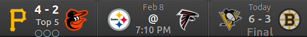
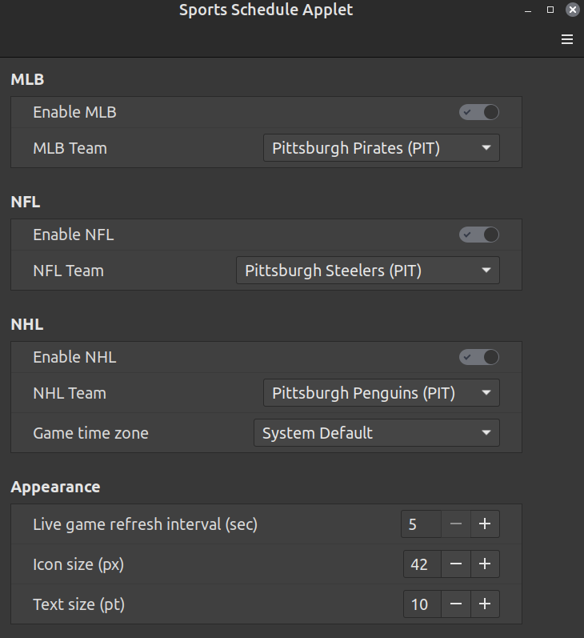

# Sports Schedule Applet

A Cinnamon desktop panel applet that displays live scores, upcoming games, and final results for your favorite MLB, NFL, or NHL team. Sits in your panel with team logos, color-coded game states, and adaptive refresh — no API key required.

## Screenshots




## Features

- **Live scores** with automatic 1-minute refresh during games
- **Multi-sport** — MLB, NFL, and NHL in a single applet
- **Smart game priority** — always shows the most relevant game (LIVE > FINAL > SCHEDULED)
- **Color-coded states** — green (live), yellow (upcoming), gray (final) at a glance
- **Hover tooltip** — next 7 days of games with scores, times, and venues
- **Click menu** — quick view of upcoming scheduled games
- **Adaptive polling** — refreshes every minute during live games, backs off to hourly when idle
- **Offseason-aware** — gracefully handles the off-season
- **No API key needed** — uses ESPN's public API

## Requirements

- Linux Mint or any distribution running **Cinnamon desktop 5.4+**
- Internet connection (for ESPN API and team logo downloads)

## Installation

1. Download or clone this repository:
   ```bash
   git clone https://github.com/SteelSmol/sports-schedule-applet.git
   ```

2. Copy to your Cinnamon applets directory:
   ```bash
   cp -r sports-schedule-applet ~/.local/share/cinnamon/applets/sports-schedule-applet@steel
   ```

3. Add the applet to your panel:
   - Right-click the Cinnamon panel → **Applets**
   - Search for **Sports Schedule Applet**
   - Click the **+** button to add it

4. Configure your team:
   - Right-click the applet → **Configure**
   - Select your sport and favorite team

## Usage

| Action | What happens |
|--------|-------------|
| **Glance** | Panel shows your team's logo, opponent, score/time, and game state |
| **Hover** | Tooltip displays the next 7 days of games |
| **Click** | Popup menu shows upcoming scheduled games |
| **Right-click → Configure** | Change sport, team, or timezone |

### Game States

| State | Panel Color | Description |
|-------|------------|-------------|
| Live | Green | Game in progress — refreshes every minute |
| Scheduled | Yellow | Upcoming game — shows start time |
| Final | Gray | Completed game — shows final score |
| Day Off | — | No games today |
| Offseason | — | Next game is 30+ days away |

## Configuration

| Setting | Description |
|---------|-------------|
| Sport | MLB, NFL, or NHL |
| Team | Your favorite team (list updates per sport) |
| Timezone | Override for game times (defaults to system timezone) |

## How It Works

The applet fetches schedule and live game data from ESPN's public API (`site.api.espn.com`). Team logos are downloaded once and cached locally. Refresh intervals adapt to game state — polling every minute during live games and backing off to hourly when nothing is happening.

## Running Tests

The test suite covers game selection, ESPN response parsing, refresh intervals, and cache logic:

```bash
node tests/runner.js
```

## Troubleshooting

**Applet shows "Loading..." forever**
Check your internet connection. ESPN's API may be temporarily unavailable.

**Icons not loading**
Delete the `assets/` directory and reload Cinnamon (Alt+F2 → `r` → Enter) to re-download logos.

**Wrong game showing**
The applet prioritizes: LIVE > FINAL (today) > SCHEDULED (today) > SCHEDULED (future). If a final game is showing, it will clear after 5 hours or at midnight.

**Reload the applet**
Press Alt+F2, type `r`, press Enter. This restarts Cinnamon and reloads all applets.

